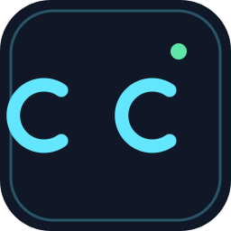
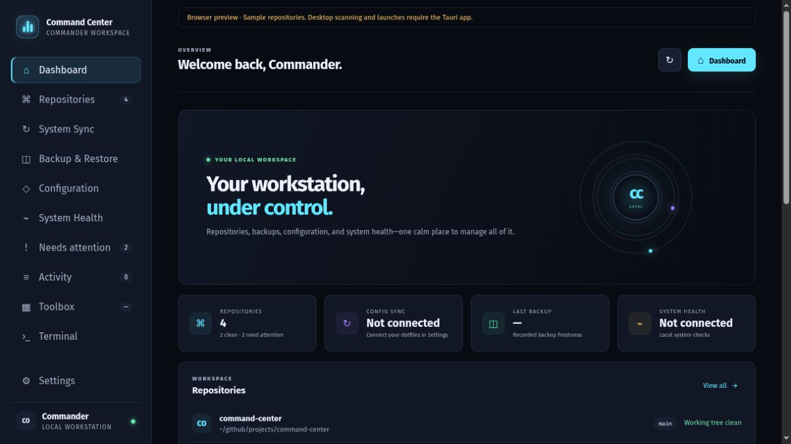

<p align="center">
  
</p>

<h1 align="center">Command Center</h1>

<p align="center"><strong>Your Linux workstation, under control.</strong></p>

<p align="center">
  A desktop home for your repositories, Toolbox, configuration, backups, and system health.<br />
  Built with Tauri, Rust, and JavaScript. Runs locally, with no account or cloud service.
</p>

<p align="center">
  <a href="https://github.com/Commanderx-code/command-center/releases/latest"></a>
  
  
  
</p>

<p align="center">
  <a href="https://github.com/Commanderx-code/command-center/releases/latest">Download</a> ·
  <a href="https://github.com/Commanderx-code/command-center/wiki">Wiki guide</a> ·
  <a href="docs/installation.md">Installation</a> ·
  <a href="docs/user-guide.md">User guide</a> ·
  <a href="CONTRIBUTING.md">Contributing</a> ·
  <a href="https://github.com/Commanderx-code/command-center/issues">Feedback</a>
</p>



_Dashboard in browser preview mode with sample data. System integrations run in the desktop app._

## One place for everyday workstation tasks

Command Center brings [Commander Toolbox](https://github.com/Commanderx-code/commander-toolbox) into a graphical desktop app and connects it to the tools you already use. Browse installers, review commands, manage Git repositories, and work with your existing Home Manager and Restic setup.

| Workspace                | What you can do                                                                                                                                                             |
| ------------------------ | --------------------------------------------------------------------------------------------------------------------------------------------------------------------------- |
| **Toolbox**              | Browse 215 bundled actions through the TUI's folders and submenus. Search, save favorites, and choose Myfish, dotfiles, or application setups.                              |
| **Interactive terminal** | Run Toolbox actions with real keyboard input, password prompts, resizing, cancellation, and exit status. Choose an external terminal when needed.                           |
| **Repositories**         | Inspect changes and history, stage files, review and commit staged changes, fetch, pull, push, organize projects, and open your editor, terminal, or project documentation. |
| **System Sync**          | Review dotfiles changes and Home Manager generations, then build and apply your configuration.                                                                              |
| **Backup & Restore**     | Run your backup helpers, browse Restic snapshots, and restore files into a new folder.                                                                                      |
| **Configuration**        | Edit Ghostty and Fastfetch through visual controls or source editors, with validation and backups.                                                                          |
| **Health & Activity**    | Check disk space, services, backup freshness, and repository attention items. Review commands and recorded job results.                                                     |

The app runs as your normal user. Commands are reviewed before execution; Toolbox scripts retain their own privilege checks and confirmations. Integration paths are editable in **Settings**. See the [user guide](docs/user-guide.md) for exact behavior and limitations.

## New in 0.7.0

- **Backup file history:** search every backup snapshot for a file, see each saved version with its date, size and whether it changed, spot files that were deleted, and restore the version you want into a new folder.

Read [Backup file history](docs/user-guide.md#backup-file-history) in the user guide.

## New in 0.6.0

- Setup imports can merge with this machine's setup, and an import interrupted by a crash or power loss is rolled back automatically on the next launch.
- Jobs in different repositories run at the same time, alongside one workstation task.
- Packages now run on glibc 2.35+ and are install-tested on Ubuntu 22.04/24.04, Debian 12, and Fedora 43. The Arch recipe is built and linted in CI.
- Toolbox favorites are saved with the app's data instead of webview storage.

Read [Setup and project workspaces](docs/setup-and-workspaces.md) and [Running several jobs](docs/user-guide.md#running-several-jobs).

## New in 0.5.0

- Portable setup bundles with a full import preview, home-path remapping, and backups before replacement.
- A first-run wizard for existing Commander-os/Home Manager and Restic connections.
- Project workspaces with reviewed build/test/dev tasks, manifest suggestions, and related service inspection.
- Keyboard navigation, focus, and reduced-motion improvements.

Read [Setup and project workspaces](docs/setup-and-workspaces.md) for setup, import behavior, and task execution.

## New in 0.4.0

- Guided maintenance workflows and local machine setup profiles.
- Personal Toolbox folders with prerequisites and structured inputs.
- Recovery tests against recorded SHA-256 baselines.
- Searchable change timeline, opt-in notifications, and a system tray.
- Service management, backup schedules, Git branches/stashes/diffs, and update checks.
- Ubuntu/Fedora package CI and a local Arch package recipe.

Read [Workflows, profiles, and recovery verification](docs/operations.md) for setup and behavior.

## Download and install

**[Get the latest release →](https://github.com/Commanderx-code/command-center/releases/latest)**

| Package         | Download v0.7.1                                                                                                                 | Install the downloaded file                            |
| --------------- | ------------------------------------------------------------------------------------------------------------------------------- | ------------------------------------------------------ |
| Debian / Ubuntu | [`.deb` · amd64](https://github.com/Commanderx-code/command-center/releases/download/v0.7.1/command-center_0.7.1_amd64.deb)     | `sudo apt install ./command-center_0.7.1_amd64.deb`    |
| Fedora / RPM    | [`.rpm` · x86_64](https://github.com/Commanderx-code/command-center/releases/download/v0.7.1/command-center-0.7.1-1.x86_64.rpm) | `sudo dnf install ./command-center-0.7.1-1.x86_64.rpm` |
| Arch / Garuda   | [`.pkg.tar.zst` · x86_64](https://github.com/Commanderx-code/command-center/releases/download/v0.7.1/command-center-0.7.1-1-x86_64.pkg.tar.zst) | `sudo pacman -U ./command-center-0.7.1-1-x86_64.pkg.tar.zst` |

Version 0.7.1 packages require **Linux x86_64, glibc 2.35+, GTK 3, and WebKitGTK 4.1**. They are install-tested on Ubuntu 22.04 and 24.04, Debian 12, and Fedora 43, and the Arch package on current Arch; the release notes link the workflow run. Release assets include `SHA256SUMS` for verification.

Arch/Garuda users can also build the same package with `makepkg -si` from `packaging/aur/`, or develop from source using the [installation guide](docs/installation.md#from-source-on-archgaruda).

## Get started

1. Launch **Command Center** from your application menu.
2. Open **Settings** to choose repository scan folders, your editor, and your terminal.
3. Review **Settings → System integrations** to connect existing dotfiles, Home Manager, backup helpers, and Restic credentials.
4. Open **Toolbox** to browse folders, choose an action, and **Review & run**.

Existing integrations can be detected on first launch or with **Detect existing setup**. Missing tools are shown as unavailable. Read [Connect your setup](docs/user-guide.md#connect-your-setup) for configuration details.

## Develop locally

With a supported Node.js version and npm installed:

```bash
git clone https://github.com/Commanderx-code/command-center.git
cd command-center
npm ci
npm run dev
```

Open `http://127.0.0.1:4173` for a browser preview with sample data. Desktop operations require Rust and the Linux system dependencies listed in the [installation guide](docs/installation.md). See [Development](docs/development.md) for checks, architecture, and packaging.

## Documentation

- **[Wiki: how to use Command Center](https://github.com/Commanderx-code/command-center/wiki)**: a step-by-step guide to every page and feature, plus troubleshooting.
- [Installation](docs/installation.md) — packages, requirements, checksums, and source builds.
- [User guide](docs/user-guide.md) — features, integrations, command behavior, and local data.
- [Development](docs/development.md) — repository layout, checks, and Toolbox updates.
- [Workflows and profiles](docs/operations.md) — maintenance recipes, personal tools, recovery tests, and notifications.
- [Changelog](CHANGELOG.md) — release highlights.
- [Contributing](CONTRIBUTING.md) — bug reports, feature requests, and pull requests.
- [Third-party notices](THIRD_PARTY.md) — bundled components and their notices.

## Built with

[Tauri](https://github.com/tauri-apps/tauri) provides the desktop shell, Rust handles local system operations, and JavaScript renders the interface. The Toolbox catalog and scripts come from [Commander Toolbox](https://github.com/Commanderx-code/commander-toolbox), built on Linutil. [xterm.js](https://github.com/xtermjs/xterm.js) and [portable-pty](https://github.com/wezterm/wezterm) power the embedded terminal.

## License

Command Center is released under the [MIT License](LICENSE). Bundled third-party components keep their own licenses; see [THIRD_PARTY.md](THIRD_PARTY.md).
